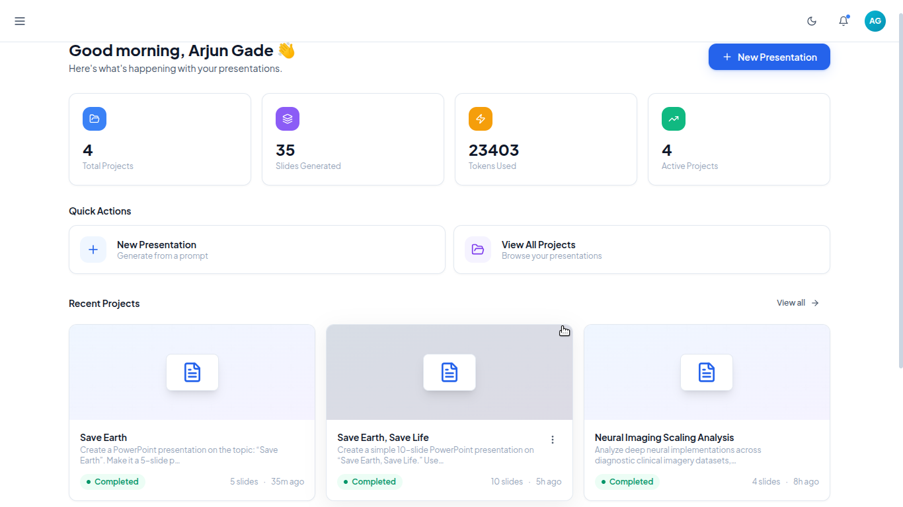
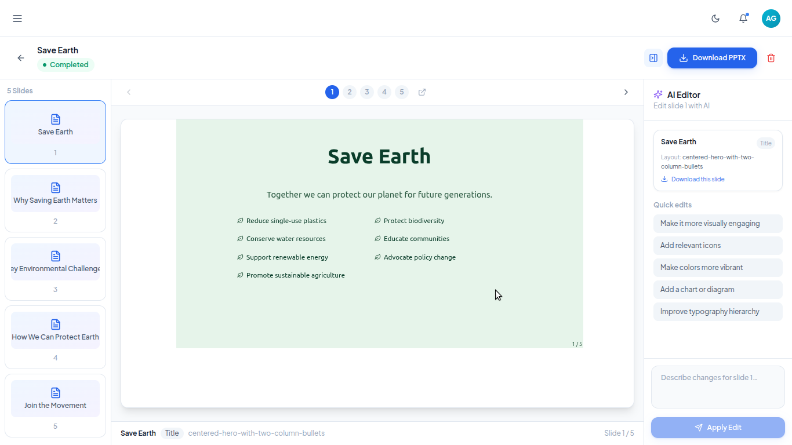
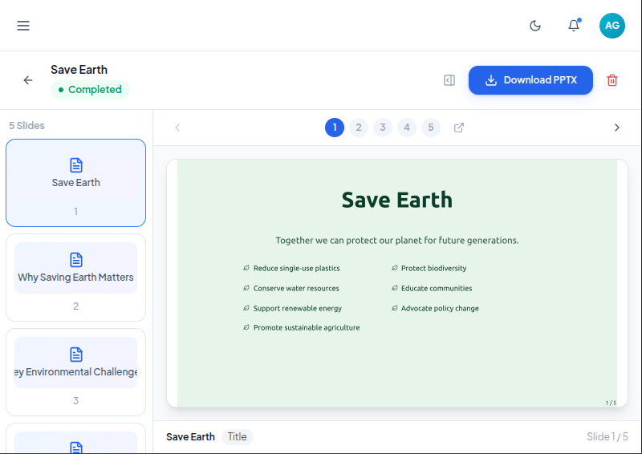

# 🚀 SlideAI — AI PowerPoint Presentation Generator

### Generate Beautiful AI-Powered PowerPoint Presentations in Seconds

AI-driven MERN stack platform that converts simple prompts into fully designed PowerPoint presentations with real-time generation pipelines, intelligent slide planning, editable slides, and modern presentation templates.

---

# ✨ Features

## 🤖 AI Presentation Generation

- Generate complete PowerPoint presentations from a single prompt
- AI-powered intent extraction and presentation planning
- Automatic slide generation pipeline
- Structured content generation with layouts
- Smart slide architecture generation
- Editable AI-generated presentations

## ⚡ Real-Time Pipeline Updates

- Live generation progress using Socket.IO
- Per-slide generation tracking
- Realtime status indicators
- Pause and resume generation support
- Error handling with live updates

## 🎨 Modern Presentation UI

- Beautiful cinematic dark theme UI
- Responsive dashboard and editor
- Interactive slide editing interface
- Smooth animations with Framer Motion
- Mobile responsive experience

## 🔐 Authentication & User Management

- JWT authentication
- Secure login/signup flow
- User-specific presentation projects
- Persistent project storage

## 🧠 Advanced Architecture

- AI pipeline-based backend
- Modular service architecture
- MongoDB project persistence
- Real-time socket communication
- Scalable MERN stack setup

---

# 🖼️ Application Screenshots

## 📊 Dashboard

The dashboard provides project management, AI generation workflow tracking, and quick access to presentations.



---

## 📝 Presentation Editor

Interactive presentation editor with real-time editing support and AI-assisted slide modifications.



---

## 📱 Mobile Responsive UI

Fully responsive mobile-first experience for generating and managing presentations on smaller devices.



---

# 🏗️ Tech Stack

## Backend

| Layer          | Technology       |
| -------------- | ---------------- |
| Runtime        | Node.js          |
| Framework      | Express.js       |
| Database       | MongoDB          |
| ODM            | Mongoose         |
| Authentication | JWT              |
| Realtime       | Socket.IO        |
| AI Pipeline    | Custom AI Agents |

---

## Frontend

| Layer            | Technology            |
| ---------------- | --------------------- |
| Framework        | React 18 + Vite       |
| Styling          | Tailwind CSS          |
| Routing          | React Router DOM v6   |
| State Management | Zustand               |
| Server State     | TanStack Query v5     |
| HTTP Client      | Axios                 |
| Animations       | Framer Motion         |
| Forms            | React Hook Form + Zod |
| Icons            | Lucide React          |
| Realtime         | Socket.IO Client      |
| Notifications    | Sonner                |

---

# 📂 Project Structure

```bash
.
├── backend/
│   ├── agents/             # AI agents for presentation generation
│   ├── config/             # Database and application configs
│   ├── controllers/        # Express route controllers
│   ├── middleware/         # Auth and custom middleware
│   ├── models/             # MongoDB schemas
│   ├── pipeline/           # AI generation pipeline logic
│   ├── public/dist/        # Frontend production build output
│   ├── routes/             # API routes
│   ├── services/           # Business logic and AI services
│   ├── .env.example
│   ├── package.json
│   └── server.js
│
└── frontend/
    ├── public/
    │   ├── icons/          # PWA icons and assets
    │   ├── screenshots/    # README screenshots
    │   └── ...
    │
    ├── src/
    │   ├── api/            # Axios API configuration
    │   ├── components/     # Reusable UI components
    │   ├── constants/      # Static constants
    │   ├── hooks/          # Custom React hooks
    │   ├── layouts/        # Layout wrappers
    │   ├── lib/            # Utility libraries
    │   ├── pages/          # Application pages
    │   ├── providers/      # Context providers
    │   ├── routes/         # Route definitions
    │   ├── services/       # Frontend service layer
    │   ├── store/          # Zustand stores
    │   └── styles/         # Global styles
    │
    ├── .env.example
    ├── package.json
    └── vite.config.js
```

---

# ⚙️ Backend Architecture

## AI Pipeline Flow

```text
User Prompt
     ↓
Intent Extraction
     ↓
Presentation Planning
     ↓
Slide Generation
     ↓
Code Generation
     ↓
Presentation Rendering
     ↓
Realtime Progress Updates
     ↓
Final PPT Ready
```

---

# 🔌 API Endpoints

# 👤 User APIs

| Method | Endpoint           | Description                    |
| ------ | ------------------ | ------------------------------ |
| POST   | `/api/user/signup` | Register a new user            |
| POST   | `/api/user/login`  | Login and receive JWT token    |
| GET    | `/api/user/me`     | Get authenticated user profile |

---

# 📁 Project APIs

| Method | Endpoint                         | Description                                 |
| ------ | -------------------------------- | ------------------------------------------- |
| POST   | `/api/project/create`            | Create and start AI presentation generation |
| GET    | `/api/project/`                  | Get all user projects                       |
| GET    | `/api/project/:projectId`        | Get single project                          |
| DELETE | `/api/project/:projectId`        | Delete project                              |
| POST   | `/api/project/:projectId/pause`  | Pause generation pipeline                   |
| POST   | `/api/project/:projectId/resume` | Resume generation pipeline                  |
| GET    | `/api/project/:projectId/state`  | Get pipeline state                          |

---

# 📡 Socket Events

The frontend listens for real-time backend events:

| Event                   | Description                        |
| ----------------------- | ---------------------------------- |
| `project:created:start` | Presentation generation started    |
| `intent:completed`      | AI intent extraction completed     |
| `planner:start`         | Slide planning started             |
| `planner:slide:status`  | Individual slide planning progress |
| `planner:completed`     | Planning completed                 |
| `coder:start`           | Slide code generation started      |
| `coder:complete`        | Slide code generation completed    |
| `project:completed`     | Final presentation generated       |
| `project:error`         | Generation failed                  |
| `editor:start`          | Slide editing started              |
| `editor:completed`      | Slide editing completed            |
| `editor:error`          | Slide editing failed               |

---

# 🚀 Getting Started

# 📦 Prerequisites

Make sure you have installed:

- Node.js
- MongoDB
- npm or yarn

---

# 🔧 Backend Setup

```bash
cd backend
```

Install dependencies:

```bash
npm install
```

Create `.env` file:

```env
OPEN_ROUTE_API_KEY=""
DB_URI=""
JWT_SECRET=""

```

Start backend server:

```bash
npm start
```

---

# 💻 Frontend Setup

```bash
cd frontend
```

Install dependencies:

```bash
npm install
```

Create `.env` file:

```env
VITE_API_URL=http://localhost:8080
```

Run frontend development server:

```bash
npm run dev
```

---

# 🏗️ Production Build

## Frontend Build

```bash
cd frontend
npm run build
```

The build output will be generated inside:

```bash
frontend/dist
```

Move the build output to:

```bash
backend/public/dist
```

---

# 🧩 Core Features Overview

## 🎯 AI Intent Extraction

The application first understands the user's prompt and extracts:

- Presentation topic
- Presentation type
- Slide count
- Design preferences
- Content structure
- Audience targeting

---

## 🧠 Intelligent Slide Planning

AI automatically plans:

- Slide hierarchy
- Section breakdown
- Content distribution
- Layout selection
- Presentation flow

---

## 🪄 Dynamic Slide Generation

The system generates:

- Titles
- Subtitles
- Bullet points
- Charts and layouts
- Structured content
- Presentation-ready formatting

---

# 📱 Responsive Design

SlideAI is fully responsive and optimized for:

- Desktop devices
- Tablets
- Mobile phones
- Large displays

---

# 🔒 Security Features

- JWT authentication
- Protected API routes
- Secure user sessions
- MongoDB schema validation
- Request validation middleware

---

# ⚡ Performance Features

- Realtime socket updates
- Optimized React rendering
- Efficient state management
- Async AI pipeline execution
- Modular backend services

---

# 🛠️ Future Improvements

- PPT export support
- Multiple design themes
- AI image generation
- Team collaboration
- Presentation sharing
- AI slide editing assistant
- Voice narration support
- Custom branding templates

---

# 🤝 Contributing

Contributions are welcome.

```bash
# Fork repository
# Create feature branch
# Commit changes
# Push branch
# Open pull request
```

---

# 📄 License

This project is licensed under the MIT License.

---

# ⭐ Support

If you like this project:

- Give it a star ⭐
- Fork the repository 🍴
- Share it with others 🚀

---

# 👨‍💻 Author

Built with ❤️ using MERN Stack + AI.
